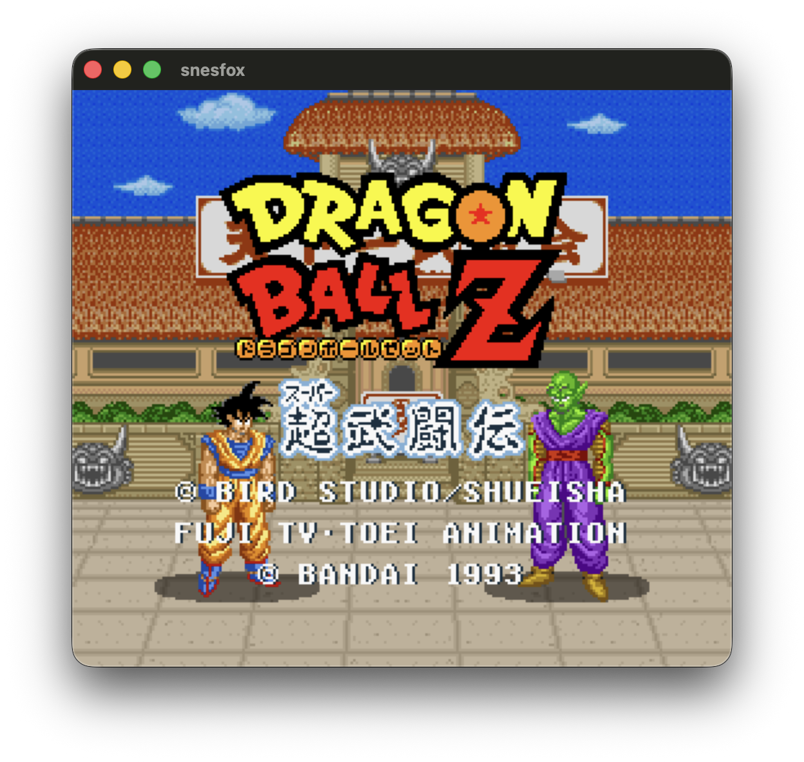
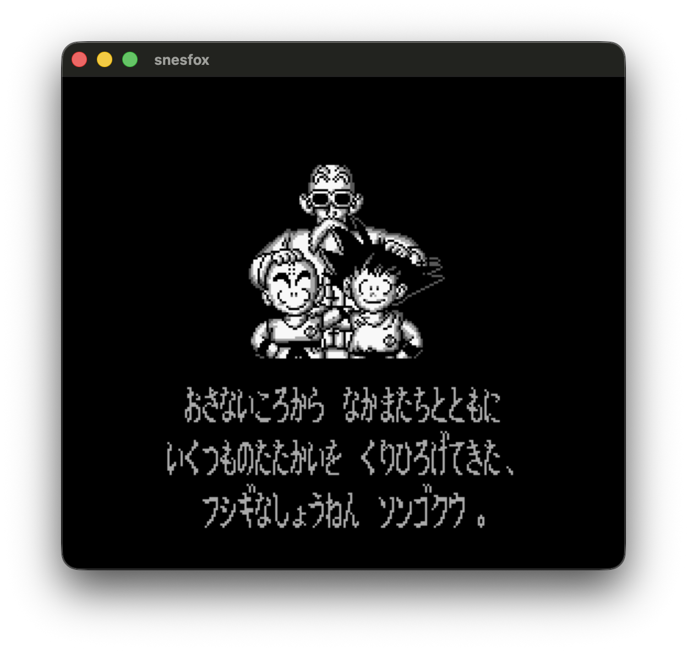

# SnesFox

SnesFox is a SNES emulator that runs your Super Nintendo game ROMs, including Super FX (GSU) games like Star Fox. It comes with a built-in debug view for peeking at what the game is doing under the hood, plus tools for taking a ROM apart and putting it back together again.

## Project layout

- `src/main.cpp` — entry point.
- `src/core/` — the emulator core (`cpu`/`ppu`/`apu`/`spc700`/`sdsp`/`gsu`/`dma`/`bus`/`rom`/`header`), the disassembler/reassembler (`disasm_dump`/`reasm`), the Dear ImGui debug UI (`display`), app wiring (`snesfox_app`), and the SDL2 audio backend (`audio_output.cpp`, macOS).
- `src/macOS/` — bare-mode's native window/input/rendering/vsync (Cocoa `NSWindow`/`NSView`, CoreGraphics blit, `CVDisplayLink`) and the native `NSOpenPanel` file dialog / File > Open ROM… menu (Objective-C++).
- `src/windows/` — the same bare-mode interfaces, implemented natively for Windows instead: a plain Win32 window (`CreateWindowExW`/`WndProc`), `GetAsyncKeyState`-polled input, a GDI `StretchDIBits` blit, `DwmFlush()` for vsync, and a DirectSound audio backend (`audio_output_directsound.cpp`) in place of macOS's SDL2 one — see [Platform backends](#platform-backends) below.
- `imgui/` — vendored Dear ImGui, compiled straight into the binary.
- `tests/` — hand-written CPU/PPU/S-DSP regression tests, run via `./snesfox selftest`.
- `roms/` — prebuilt fixture ROMs (PVSnesLib demos, `hello_world.sfc`, etc.) used for manual and scripted testing.
- `tools/` — standalone Python helpers (opcode-table generation, BG3 CHR heuristic check, app icon generation).

## Platform backends

The debug UI (`--debug`) is SDL2 on both platforms — a plain `SDL_CreateWindow` + accelerated
`SDL_Renderer`, with Dear ImGui's SDL2 backend on top. The bare game-only window (no `--debug`)
skips SDL entirely and goes native, with a different backend per platform for window, input,
rendering, vsync, and audio:

| | macOS | Windows |
|---|---|---|
| Window | Cocoa (`NSWindow`/`NSView`) | Win32 (`CreateWindowExW`/`WndProc`) |
| Input | `NSEvent` local monitor | `GetAsyncKeyState` polling |
| Rendering | CoreGraphics (`CGContextDrawImage`) | GDI (`StretchDIBits`) |
| Vsync | `CVDisplayLink` | `DwmFlush()` |
| Audio (both modes) | SDL2 (`SDL_QueueAudio`) | DirectSound (`IDirectSoundBuffer8`) |

Audio is the one piece that isn't native-per-platform-in-bare-mode-only — it uses the same
backend in both debug and bare mode, and Windows uses DirectSound instead of SDL2 specifically
(SDL2's own WASAPI/DirectSound backend selection and buffer negotiation was a source of audio
crackle/distortion on Windows that switching to DirectSound directly resolved — matching what
Mesen2 itself does on Windows).

## Installation

Native builds are macOS-only: `release-emu-binary.sh` invokes `clang++` directly with hardcoded Homebrew paths and links the Cocoa/UniformTypeIdentifiers frameworks — there's no CMake/configure step and no Linux path yet. A Windows binary is available too, built by cross-compiling from macOS/Linux with mingw-w64 — see [Windows](#windows-cross-compiled) below.

### macOS

1. **Clone the repository:**

   ```bash
   git clone https://github.com/MisterDigifox/SnesFox.git
   cd SnesFox
   ```

2. **Install prerequisites:**

   ```bash
   xcode-select --install   # Xcode Command Line Tools: clang++ and the Cocoa/.mm file dialog
   brew install sdl2
   ```

   SDL2 is the only external library dependency — Dear ImGui is vendored in-tree under `imgui/` and compiled straight into the binary, so there's nothing to install for it. If Homebrew lives somewhere other than `/opt/homebrew` (e.g. an Intel Mac using `/usr/local`), edit the `-I`/`-L` paths in `release-emu-binary.sh` to match before building.

3. **Build the project** — see [macOS binary](#macos-binary) below.

### Windows

There's no native Windows toolchain path — instead, `release-emu-binary-windows.sh` cross-compiles `snesfox.exe` from macOS (or Linux) using mingw-w64.

1. **Install mingw-w64:**

   ```bash
   brew install mingw-w64
   ```

2. **Build the project** — see [Windows executable](#windows-executable) below.

## How to build the emulator

### macOS binary

```bash
./release-emu-binary.sh
```

### macOS app

```bash
./release-emu-binary-app.sh
open SnesFox.app
```

### Windows executable

```bash
./release-emu-binary-windows.sh
```

## How to build a game embedded in the emulator

### macOS binary

```bash
./release-game-binary.sh
```

Builds `./Transparency` (or whatever `ROM_NAME` is set to) at the project root, same
prerequisites as the [macOS emulator binary](#macos-binary) above.

### macOS app

```bash
./release-game-app.sh
open Transparency.app
```

Wraps the game binary into a double-clickable `.app` bundle (procedurally-drawn icon, ad
hoc codesigned) — same packaging `release-emu-binary-app.sh` does for the emulator, but
without the ROM file-association `Info.plist` entries since there's no ROM to pick.

### Windows executable

```bash
./release-game-binary-windows.sh
```

Cross-compiles `Transparency.exe` the same way `release-emu-binary-windows.sh` cross-compiles
`snesfox.exe` (mingw-w64, downloaded/cached SDL2, `src/windows/native_file_dialog.cpp`,
statically-linked runtime) — same [Windows prerequisites](#windows) apply. Ship the produced
`.exe` together with the `SDL2.dll` copied alongside it.

## Usage

### Emulation

`./snesfox` has two windowed modes, chosen by whether `--debug` is passed:

```bash
./snesfox smw.sfc              # bare game-only window: just the framebuffer, no toolbar/panels
./snesfox --debug smw.sfc      # full debug UI: CPU/PPU/APU/GSU state panels, instruction log, toolbar
```

Omitting the ROM path (`./snesfox` / `./snesfox --debug`) opens the same window with nothing loaded yet — use the debug UI's Load button, **File > Open ROM…** (`Cmd+O`), or drag-and-drop to pick one afterward. `--debug` also accepts `--log-cpu`/`--log-gsu` to dump every executed CPU/GSU instruction to `cpu.asm`/`gsu.asm`:

```bash
./snesfox --debug game.sfc --log-cpu --log-gsu
```

The debug UI adds: a left panel with ROM/CPU/PPU/GSU/APU state, an instruction log, and a Pause/Resume/Step/Next-Frame/Reset toolbar; the scaled framebuffer; a right panel of clickable CGRAM palette swatches with a live RGB editor; a full-VRAM tile viewer; and, for Super FX titles, a GSU work-RAM viewer.

The bare game window is freely resizable (drag any edge — the framebuffer rescales live, even mid-drag) and supports fullscreen. Keyboard shortcuts (either mode): `Space` steps one instruction while paused, `F11` toggles fullscreen, `Escape` exits fullscreen (bare window) or toggles pause (debug UI).

### Self-test

Run the in-binary CPU/PPU/S-DSP regression tests — no ROM required:

```bash
./snesfox selftest
```

Nonzero exit code on any failure.

### Read ROM header

Print copier-header detection (512-byte `.smc` strip), cartridge metadata at the SNES-internal header offsets, LoROM/HiROM detection, title, checksum pair, and related fields:

```bash
./snesfox header smw.sfc
```

### PPU/VRAM snapshot

Run headlessly (no SDL window) for a number of frames and dump PPU/VRAM heuristics:

```bash
./snesfox snap smw.sfc 120
```

`frames` defaults to **120** if omitted.

### Disassemble a ROM

```bash
./snesfox disasm smw.sfc
```

Writes `output.asm` by default. Specify the output path:

```bash
./snesfox disasm smw.sfc mydump.asm
```

### Reassemble into a ROM

```bash
./snesfox reasm output.asm out.sfc
```

### Execution coverage (optional)

Run the emulator headlessly for a number of simulated frames and record every 24-bit PC fetched as an instruction. Writes a small text file (sorted hex PCs plus a header line):

```bash
./snesfox cov smw.sfc trace.cov
```

Default duration is **600 frames**. Override with a third numeric argument:

```bash
./snesfox cov smw.sfc trace.cov 1200
```

Annotate the disassembly so PCs seen in the trace get a trailing `  ; cov` comment (stripped by `reasm`, safe for round-trip):

```bash
./snesfox cov smw.sfc trace.cov
./snesfox disasm smw.sfc output.asm trace.cov
```

Coverage reflects what **this emulator** executed in that run, not necessarily every path in the game.

Designed to round-trip the assembler text produced by `disasm` for supported dumps.

## Preview



