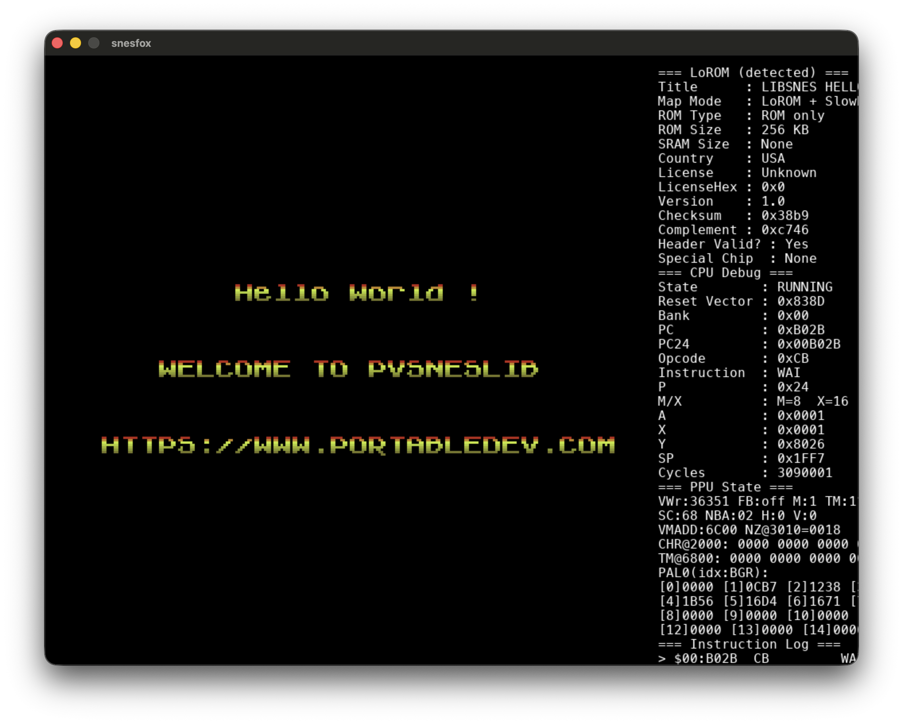

# SnesFox

Toolkit for SNES ROM exploration: lightweight CPU emulation with a debug UI, LoROM-oriented disassembler and round-trip reassembler, plus optional execution coverage.

Emulation notes: general-purpose DMA (`$420B`) and per-scanline HDMA (`$420C`, direct and indirect table modes) are supported for PPU B-bus targets such as per-line scrolling. The CPU loop advances **`Bus::kCyclesPerFrame`** cycles per drawn frame (**262 × 114**), matching scanline stepping in `Bus::stepPeripherals` (older builds used `30000`, which drifted ~132 cycles/frame vs the raster).

## Dependencies (macOS)

```bash
brew install sdl2
brew install sdl2_ttf
```

Adjust Include/Library paths in `build.sh` if Homebrew lives somewhere other than `/opt/homebrew`.

## Build

```bash
./build.sh
```

Produces the `snesfox` executable in the project directory. On macOS the script also applies an **ad hoc codesign** so some systems do not terminate the binary immediately (`zsh: killed`).

If you still see **`zsh: killed`** after rebuilding, sign manually (`codesign --force -s - ./snesfox`), clear quarantine (`xattr -cr ./snesfox`), or check corporate antivirus / SIP logs. Always pass a **subcommand** (e.g. `./snesfox emu game.sfc`); `./snesfox` alone only prints usage and exits with code **1**.

## Usage

### Read ROM header

Print copier-header detection (512-byte `.smc` strip), cartridge metadata at the SNES-internal header offsets, LoROM/HiROM detection, title, checksum pair, and related fields:

```bash
./snesfox header smw.sfc
```

### Disassemble a ROM

```bash
./snesfox disasm smw.sfc
```

Writes `output.asm` by default. Specify the output path:

```bash
./snesfox disasm smw.sfc mydump.asm
```

### Execution coverage (optional)

Run the emulator headlessly for a number of simulated frames and record every 24-bit PC fetched as an instruction. Writes a small text file (sorted hex PCs plus a header line):

```bash
./snesfox cov smw.sfc trace.cov
```

Default duration is **600 frames**. Override with a third numeric argument:

```bash
./snesfox cov smw.sfc trace.cov 1200
```

Annotate the disassembly so PCs seen in the trace get a trailing `  ; cov` comment (stripped by `reasm`, safe for round-trip):

```bash
./snesfox cov smw.sfc trace.cov
./snesfox disasm smw.sfc output.asm trace.cov
```

Coverage reflects what **this emulator** executed in that run, not necessarily every path in the game.

### Reassemble into a ROM

```bash
./snesfox reasm output.asm out.sfc
```

Designed to round-trip the assembler text produced by `disasm` for supported dumps.

### Interactive emulation (SDL)

```bash
./snesfox emu smw.sfc
```

Opens the debug window (pause, single-step).

**APU / SPC700:** The SPC700 runs at IPL (`$FFC0`) using the built‑in boot ROM (documented disassembly mirrors nocash *fullsnes*). Main‑CPU ports **`$2140`–`$2143`** are the four **CPU→SPC** latches; the SPC sees them as **`$00F4`–`$00F7`** reads, and writes to those addresses are the **SPC→CPU** side visible to **`$2140`–`$2143`** reads (including the IPL **`$AA` / `$BB`** ready signal after zero‑page clear). Scheduling uses a coarse **12:7** carry (SNES CPU vs 1.024 MHz SMP). **S-DSP is not emulated:** reads of **`$F3`** return **idle (0)** and writes there are cleared immediately so SPC code that busy‑waits on the DSP does not wedge the upload/handshake with the main CPU. If a ROM still hangs, run with **`SNESFOX_SPC_LOG=1`** to log illegal opcodes or **`STOP`**; undefined opcodes are treated as **2‑cycle NOP** by default (set **`SNESFOX_SPC_STRICT=1`** to halt on them again). For unusual ROMs that insist ports read as **zero before** the IPL handshake, set **`SNESFOX_APU_PORTS_ZERO=1`** so resets start with zeroed port latches.

## Preview


